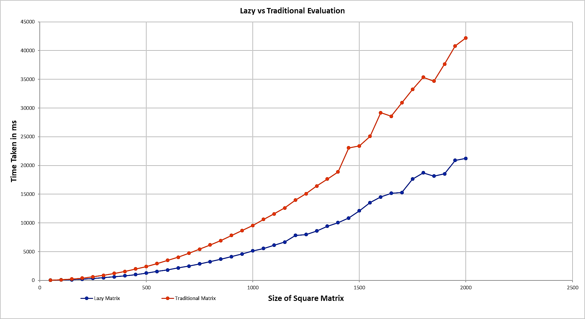

# Simple Matrix Library
 *A simple matrix library that use expression templates and modern concepts of C++ to solve algebric expressions. This project is built for Programming Competency Test under GSoC2O19/Boost/uBLAS.*
## Prerequisites

```
Clang (minimum -v7.0.1)
```

## Using this Library 

*1.  Clone the repository.*
```
git clone https://github.com/NavneetSurana/uBLAS-Programming-Competency-Test.git
```

*2.  Include lazy_matrix.h in your source file.*
```
#include"path-to-the-cloned-repo/include/lazy_matrix.h"
```

*3. Use clang compiler for compilation.*
```
clang++ -std=c++17 [your src file name].cpp -o build
```
```
./build
```

## Documentation

*Please refer to [Simple Matrix Library](https://navneetsurana.github.io/uBLAS-Programming-Competency-Test) for documentation.*

## Features

*The table below shows various operations that can be performed using this library along with short description.*

| Operators | Expression Templates Used|Description|
|:---:|:--------------------------:|:-----------:|
| `%`  |   `Yes` | *Performs standard Matrix-Matrix Multiplication*|
| `%=` |   `No`  | *Performs assignment after standard Matrix-Matrix Multiplication*|
| `+`  |   `Yes` | *Performs element-wise Matrix-Matrix Addition*|
| `+=` |   `No`  | *Performs assignment after element-wise Matrix-Matrix Addition*|
| `-`  |   `Yes` | *Performs element-wise Matrix-Matrix Subtraction*|
| `-=` |   `No`  | *Performs assignment after element-wise Matrix-Matrix Subtraction*|
| `/`  |   `Yes` | *Performs element-wise Matrix-Matrix Division*|
| `/=` |   `No`  | *Performs assignment after element-wise Matrix-Matrix Division*|
| `*`  |   `Yes` | *Performs element-wise Matrix-Matrix Multiplication*|
| `*=` |   `No`  | *Performs assignment after element-wise Matrix-Matrix Multiplication*|

## Benchmark

*Inorder to test how fast [lazy_matrix](include/lazy_matrix.h) libraray works I have tested it against traditional way of solving Matrix algebric expressions and the same can be found in [trad_matrix.h](include/trad_matrix.h). Using [test_case_generator.cpp](test_case_generator.cpp) file have generated some random expression of length 300 involving operators like `+`,`-`,`/`,`*` and  `+=`. The [benchmark.h](include/benchmark.h) file is used for testing and extracting the results of the test.After executing the test using [main.cpp](main.cpp), the results are being conveyed in the plot below.For proof one can see [proof.png](proof.png) and for test logs one can see [test_logs.txt](test_logs.txt).*




