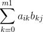
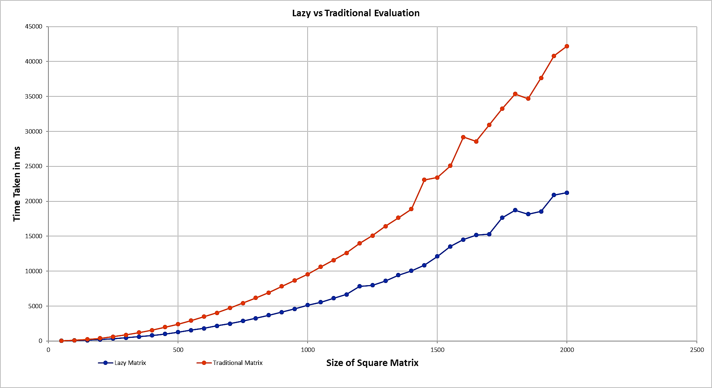

# Simple Matrix Library
 *A simple matrix library that use expression templates and modern concepts of C++ to solve algebric expressions. This project is built for Programming Competency Test under GSoC2O19/Boost/uBLAS.*
## Prerequisites

```
Clang -v 7.0.1 or greater
```

## Using this Library 

*1.  Clone the repository.*
```
git clone https://github.com/NavneetSurana/uBLAS-Programming-Competency-Test.git
```

*2.  Include lazy_matrix.h in your source file.*
```
#include"path-to-the-cloned-repo/include/lazy_matrix.h"
```

*3. Use clang compiler for compilation.*
```
clang++ -std=c++17 [your src file name].cpp -o build
```
```
./build
```

## Documentation

*Please refer to [Simple Matrix Library](https://navneetsurana.github.io/uBLAS-Programming-Competency-Test) for documentation.*

## Features

*The table below shows various operations that can be performed using this library along with short description.*

| Operators | Expression Templates Used|Description|
|:---:|:--------------------------:|:-----------:|
| `%`  |   `Yes` | *Performs standard Matrix-Matrix Multiplication*|
| `%=` |   `No`  | *Performs assignment after standard Matrix-Matrix Multiplication*|
| `+`  |   `Yes` | *Performs element-wise Matrix-Matrix Addition*|
| `+=` |   `No`  | *Performs assignment after element-wise Matrix-Matrix Addition*|
| `-`  |   `Yes` | *Performs element-wise Matrix-Matrix Subtraction*|
| `-=` |   `No`  | *Performs assignment after element-wise Matrix-Matrix Subtraction*|
| `/`  |   `Yes` | *Performs element-wise Matrix-Matrix Division*|
| `/=` |   `No`  | *Performs assignment after element-wise Matrix-Matrix Division*|
| `*`  |   `Yes` | *Performs element-wise Matrix-Matrix Multiplication*|
| `*=` |   `No`  | *Performs assignment after element-wise Matrix-Matrix Multiplication*|
| `=`  |   `No`  | *Performs assignment of to a given Matrix*|
| `==` |   `No`  | *Performs comparison in Matrices* |
## Efficiency Test

*Inorder to know how fast [lazy_matrix](include/lazy_matrix.h) libraray works I have tested it against traditional way of solving Matrix algebric expressions and the same can be found in [trad_matrix.h](include/trad_matrix.h). Using the [test_case_generator.cpp](src/test_case_generator.cpp) file I have generated some random expression of length 300 involving operators like `+`,`-`,`/`,`*` and  `+=`. The [benchmark.h](include/benchmark.h) file has been used for testing and extracting the results of the test. After executing the test using [main.cpp](src/main.cpp) file, the results have been conveyed in the plot below. For proof one can see [proof.png](other/proof.png) and for test logs one can see [test_logs.txt](other/test_logs.txt). From the graph below one can see that Lazy Evaluation is nearly 50% more efficient than the Traditional way of Evaluation.*

***Note***: *The test above involved only element-wise operations. The operator `%` for Standard Matrix-Matrix Multiplication is coded without using temporaries, which unnecessarily increased the complexity due to redundant evaluation of the same elements in  . One way to reduce complexity is to evaluate operator `%` as and when encountered and store the result in a temporary or do something related to optimization of the expression templates tree.*




## Author

* **Navneet Surana** - *Some of my works can be viewed at* - [GitHub](https://github.com/NavneetSurana)
* *Along with this I have also worked on solving 9X9 Sudoku Puzzle using genetic algorithm.*
---
* *Thanks to GitHub for providing such an amazing open-source platform.*
* *I hope this project brings in new opportunities for me.*

 


